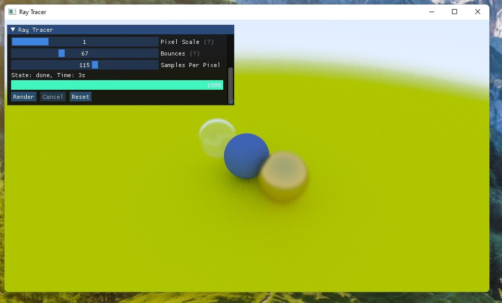

# Ray Tracer

It's a ray tracer! 

Based on [Ray Tracing in One Weekend](https://raytracing.github.io/books/RayTracingInOneWeekend.html), but with quite a few changes and improvements:

* multi-threading
* emscripten/wasm version
* SDL & IMGUI interface
* glm instead of custom math classes

TODO:
* mesh support
* lighting support
* textures